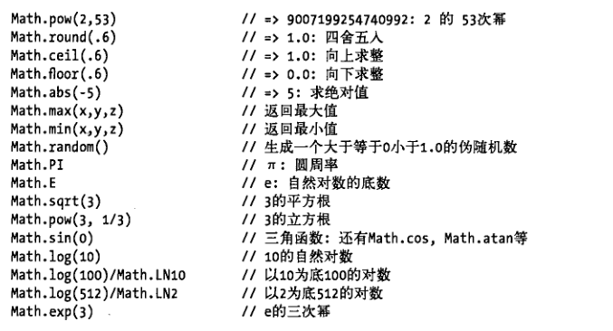

### 常用的对象方法

### 数学对象Math

  
  
### 数组方法 Array
-  push：向数组的末尾增加一项
-  unshift：向数组开头增加一项
-  pop:删除数组的末尾项
- shift:删除数组开头项
```
var arr = [1, 2, 3, 4, 5];
console.log(arr);
console.log(arr.push(0));//从后面添加元素 返回新数组的长度
console.log(arr.pop());//从后面删除元素 返回被删除的元素
console.log(arr.shift());//从前面删除元素 返回被删除的元素
console.log(arr.unshift(0));//从前面添加元素 返回新数组的长度
console.log(arr);
```
- join:把数组中的每一项 按照指定的分隔符拼接成字符串
```
var arr = ["刘备", "张飞", "关羽"];
console.log(arr.join("|"));
```
- reverse:倒序数组 返回值倒序数组 原有数组改变
```
var arr = ["a", "b", "c", "d"];
console.log(arr);
console.log(arr.reverse())
```
- sort:根据匿名函数进行冒泡排序 b-a倒序 a-b升序
```
  var  num = [10,4,78,2,70];
  function sortNumber(a,b) {
      return a-b;   // a - b  冒泡的升序排序
  }
  function sortNum(a,b) {
      return b - a;  //  b -a  冒泡的降序排序
  }
  console.log( num.sort(sortNumber) );
  console.log( num.sort(sortNum) );
```
- filter() 方法将匹配元素集合缩减为匹配指定选择器的元素。
```
//工资的数组[1500,1200,2000,2100,1800]把工资大于等于2000的删除
    var arr = [1500, 1200, 2000, 2100, 1800];
    console.log(arr);
    var newArr = arr.filter(function (element, index, array) {
        //console.log(element);
        //console.log(index);
        //console.log(array);
        if (element > 2000) {
            return false;
        }
        return true;
    });
    console.log(newArr);
```
- concat:把一个数组和另一个数组拼接在一起
```
    var arr1 = [1,2,3];  // arr1 数组
    var arr2 = ["a","b","c"];  // arr2 数组
    var newArr =  arr1.concat(arr2) ;  // 连接之后生成的新的数组赋值给 newArr
    console.log(newArr);//[1,2,3,a,b,c]
```
- slice:返回数组的一部分
```
    var arr = [4, 6, 7, 8, 3, 46, 8];
    console.log(arr.slice(0, 2));//slice 不会改变原数组 [4,6] 开始能取到 结束取不到
    console.log(arr)//[4, 6, 7, 8, 3, 46, 8]
```
- splice:插入、删除或替换数组的元素
```
    var arr = [4, 6, 7, 8, 3, 46, 8];
    console.log(arr.splice(3, 3));//splice 会改变原数组 [8,3,46]   1开始 2个数 3要加入的元素
    console.log(arr)//[4, 6, 7, 8]
```
### 字符串对象
 -  截取字符串
 ```
     var str = "我爱中华人民共和国";
    //slice()     //从start位置开始，截取到end位置，end取不到
    //substring() //从start位置开始，截取到end位置，end取不到
    //substr()    //从start位置开始，截取length个字符
    console.log(str.slice(1, 2)); //爱
    console.log(str.substring(1, 2)) //爱
    console.log(str.substr(2,5)) //中华人民共
```
 - 位置方法
 ```
    //"abcoefoxyozzopp"查找字符串中所有o出现的位置
    var str = "abcoefoxyozzopp";
    console.log(str.indexOf("o"))//3
    console.log(str.lastIndexOf("o"))//12
    var index=-1;
    do{
        index=str.indexOf("o",index+1);
        console.log(index)//3,6,9,12,-1
    }while(index!==-1)
 ```
 - 替换方法
 ```
     //把字符串中所有的o替换成-
    var str = "abcoefoxyozzopp";
    console.log(str);
    //console.log(str.replace(/o/g,"-"))//abc-ef-xy-zz-pp
    do{
        str=str.replace("o","-")
    }while(str.indexOf("o")!==-1)
    console.log(str);//abc-ef-xy-zz-pp
 ```
 - 其他方法
 ```
    1.//统计一个字符串中每个字符出现的次数
    var str = "abcoefoxyozzopp";
    var o={};
    for (var i = 0; i < str.length; i++) {
        //var item = str[i];//每个字符
        var item = str.charAt(i);//所有浏览器都支持
        if(o[item]){
          o[item]=o[item]+1;
        }else{
            o[item]=1;
        }
    };
    console.log(o)
    2.//把一个字符串中所有的空格全部去掉" aaa df sdd sds sd "
    var str = " aaa df sdd sds sd ";
    console.log(str);
    //console.log(str.trim());//只能去掉两端的空白符 "aaa df sdd sds sd"
    var arr = str.split(" ");//按照指定字符 对字符串进行切割 返回一个数组
    console.log(arr);
    console.log(arr.join(""));//aaadfsddsdssd
    3.//把一个字符串中的所有字符大小写
    var str = "aBcDeF";
    console.log(str.toUpperCase());//ABCDEF
    console.log(str.toLowerCase());//abcdef
    console.log(str.toLocaleUpperCase());//ABCDEF
    console.log(str.toLocaleLowerCase());//abcdef
 ```
